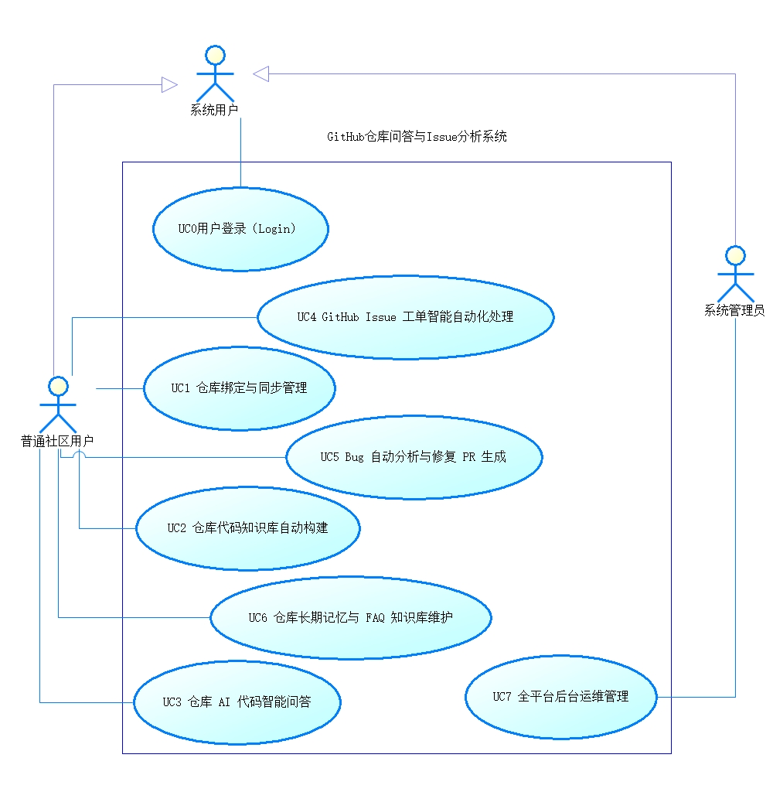
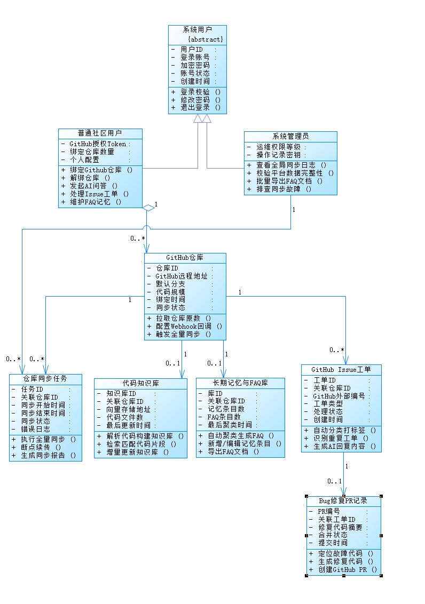

# 系统UML建模说明文档
## 1 系统参与者分层设计
本系统使用UML泛化抽象角色，划分两类内部使用者、外部交互第三方：
1. **抽象顶层角色：系统用户{abstract}**
普通社区用户、系统管理员共同继承该抽象类，复用登录校验、修改密码、退出登录公共功能，避免重复建模。
2. **普通社区用户**
具备UC0~UC6全部私有仓库业务权限，可绑定GitHub仓库、构建代码知识库、使用AI代码问答、自动化处理Issue工单、生成Bug修复PR、维护FAQ记忆库；仅能操作本人绑定仓库。
3. **系统管理员**
仅拥有UC7全平台运维权限，无用户私有仓库读写权限，负责全局同步监控、平台数据校验、批量导出FAQ文档、同步故障排查。
4. **外部交互对象：GitHub平台**
第三方API交互系统，参与仓库代码同步、Issue工单拉取、修复PR创建业务流程。

## 2 UML用例图展示与说明

### 建模规范说明
1. 用例粒度：不按页面按钮细碎拆分，以用户完整独立业务目标划分，共8条顶层标准用例，符合软件工程UML需求分析标准；
2. 权限隔离：普通用户仅关联UC0~UC6仓库业务用例，管理员仅关联UC7运维用例，两类角色业务边界完全切割；
3. 业务覆盖：完整覆盖仓库绑定同步、代码RAG智能问答、Issue自动化处理、全平台运维四大产品核心能力。

## 3 面向对象概念类图展示与说明

### 实体关系梳理
1. 泛化关系：普通社区用户、系统管理员 继承抽象父类「系统用户」；
2. 聚合关系：单个用户可绑定0~多个GitHub仓库；单个仓库对应多条同步任务、一套代码知识库、一套FAQ记忆库、多条Issue工单；
3. 关联关系：单条Issue工单可生成0或1条Bug修复PR记录；
4. 每个实体定义业务属性与对外操作方法，承接全部用例业务流程，为后续数据库ER建模、前后端数据结构设计提供统一依据。

## 4 建模交付总结
本次迭代全套UML建模包含参与者分层、用例需求建模、对象实体类图三层分析，图纸与配套文字说明统一归档至UIPrototype/uml_model目录，满足迭代交付要求。